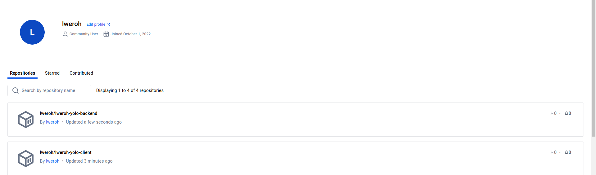
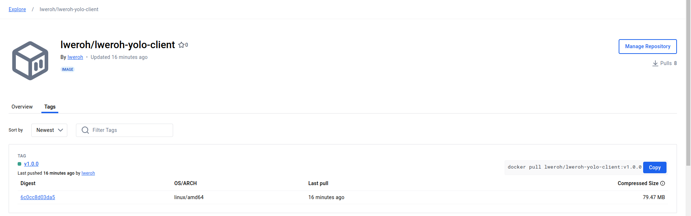

# Overview
This project involved the containerization of a full-stack yolo application using Docker.

# Requirements
Install the docker engine here:
- [Docker](https://docs.docker.com/engine/install/)

Install VirtualBox and vagrant

## Images on Dockerhub

## Image tags and their sizes

## How to run the app
docker pull lweroh/lweroh-yolo-client:v1.0.0
docker pull lweroh/lweroh-yolo-backend:v1.0.0

or 

docker compose build
docker compose up

## How to run a virtualized yolo application

Ensure your at the root of the project directory
Run Vagrant up --provision command to spin up virtual machine on your sytstem